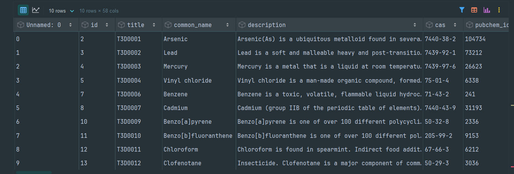

## Проект: Анализ базы данных токсинов и их мишеней
**Проект реализуется в рамках дисциплины ИТМО "Инжиниринг управления данными".**

Датасет, выбранный для анализа, содержит полную и актуальную информацию о наиболее часто встречающихся токсинах. Он состоит из 58 столбцов, каждый из которых содержит определенные характеристики токсичных соединений. В рамках проекта реализован ETL-пайплайн для обработки данных, а также проведён EDA-анализ с визуализацией распределений и зависимостей между основными параметрами токсинов. Эти данные актуальны для изучения биохимических механизмов токсичности, разработки методов детоксикации и прогнозирования вредного действия соединений.

--------------------------------------------------------------
* Ссылка на исследуемый датасет: https://clck.ru/3Q5uXV
* Исходный источник датасета (kaggle): https://clck.ru/3Q5uXr
--------------------------------------------------------------

## Структура проекта: 

## Установка виртуального окружения:
1. Для Windows необходимо открыть Powershell и ввести команду: *python -m venv venv*;
2. И команду venv\Scripts\activate; 
3. Все необходимые пакеты содержатся в файле **requirements.txt**, для их установки вводим команду *pip install -r requirements.txt*; 

## Работа с датасетом
С помощью скрипта **data_loader.py** производится чтение датасета и ввод первых десяти строк. Результат работы скрипта представлен ниже:

Приведение типов данных в датасете также реализуется с помощью **data_loader.py**. До преобразований все данные во всех столбцах принадлежали к типу object. Результат после преобразования типов представлен в таблице ниже: 

| **Тип данных**          | **Колонки**                                                                                                                                                                                                                                                                                                                                                                                                                                                                                                                                                      |
| ----------------------- | ---------------------------------------------------------------------------------------------------------------------------------------------------------------------------------------------------------------------------------------------------------------------------------------------------------------------------------------------------------------------------------------------------------------------------------------------------------------------------------------------------------------------------------------------------------------- |
| **float64**             | id, pubchem_id, weight, melting_point, boiling_point, lethaldose, min_risk_level, actor_id, export, moldb_average_mass, moldb_mono_mass, logp                                                                                                                                                                                                                                                                                                                                                                                                                    |
| **string[python]**      | title, common_name, description, cas, chemical_formula, appearance, solubility, route_of_exposure, mechanism_of_toxicity, metabolism, toxicity, carcinogenicity, use_source, health_effects, symptoms, treatment, wikipedia, uniprot_id, kegg_compound_id, omim_id, chebi_id, biocyc_id, ctd_id, stitch_id, drugbank_id, pdb_id, moldb_smiles, moldb_formula, moldb_inchi, moldb_inchikey, origin, state, hmdb_id, chembl_id, chemspider_id, biodb_id, synthesis_reference, structure_image_caption, synonyms_list, types, cellular_locations, tissues, pathways |
| **datetime64[ns, UTC]** | created_at, updated_at                                                                                                                                                                                                                                                                                                                                                                                                                                                                                                                                           |

## ETL
Для запуска полного ETL-процесса достаточно ввести в терминале команду **python main.py**. Файлы, необходимые для запуска ETL находятся в одноименной папке в этом репозитории.

## EDA
Также для этого датасета был проведен EDA-анализ
*По ссылке доступна интерактивная версия ноутбука с EDA-анализом:* [Открыть EDA.ipynb через nbviewer.org](https://nbviewer.org/github/nverlis/project/blob/master/notebooks/EDA.ipynb)

