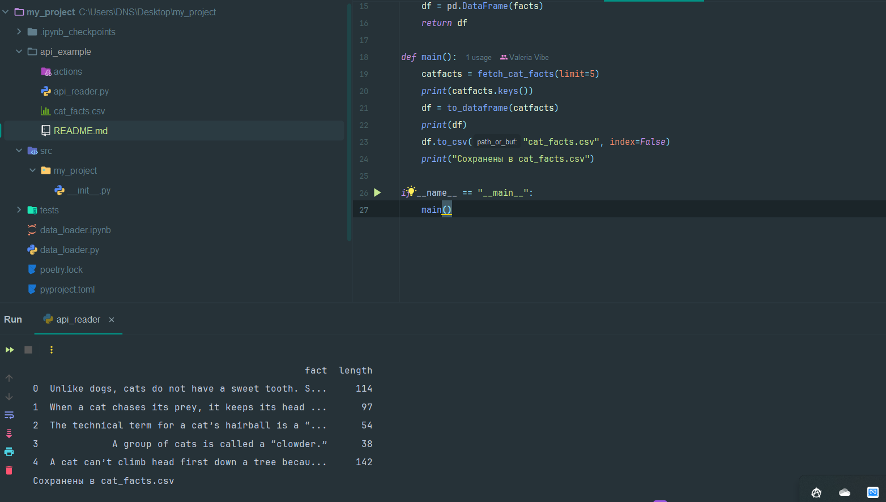

Ссылка на выбранный API: https://catfact.ninja

Структура скрипта: 

def fetch_cat_facts(limit=5):
    url = f"https://catfact.ninja/facts?limit={limit}"
    response = requests.get(url)
    if response.status_code != 200:
        raise Exception(f"Ошибка запроса: {response.status_code}")
    data = response.json()
    return data

def to_dataframe(catfacts_json):
    facts = catfacts_json.get("data", [])
    df = pd.DataFrame(facts)
    return df

def main():
    catfacts = fetch_cat_facts(limit=5)
    print(catfacts.keys())
    df = to_dataframe(catfacts)
    print(df)
    df.to_csv("cat_facts.csv", index=False)
    print("Сохранены в cat_facts.csv")

if __name__ == "__main__":
    main()

Результат работы скрипта: 

